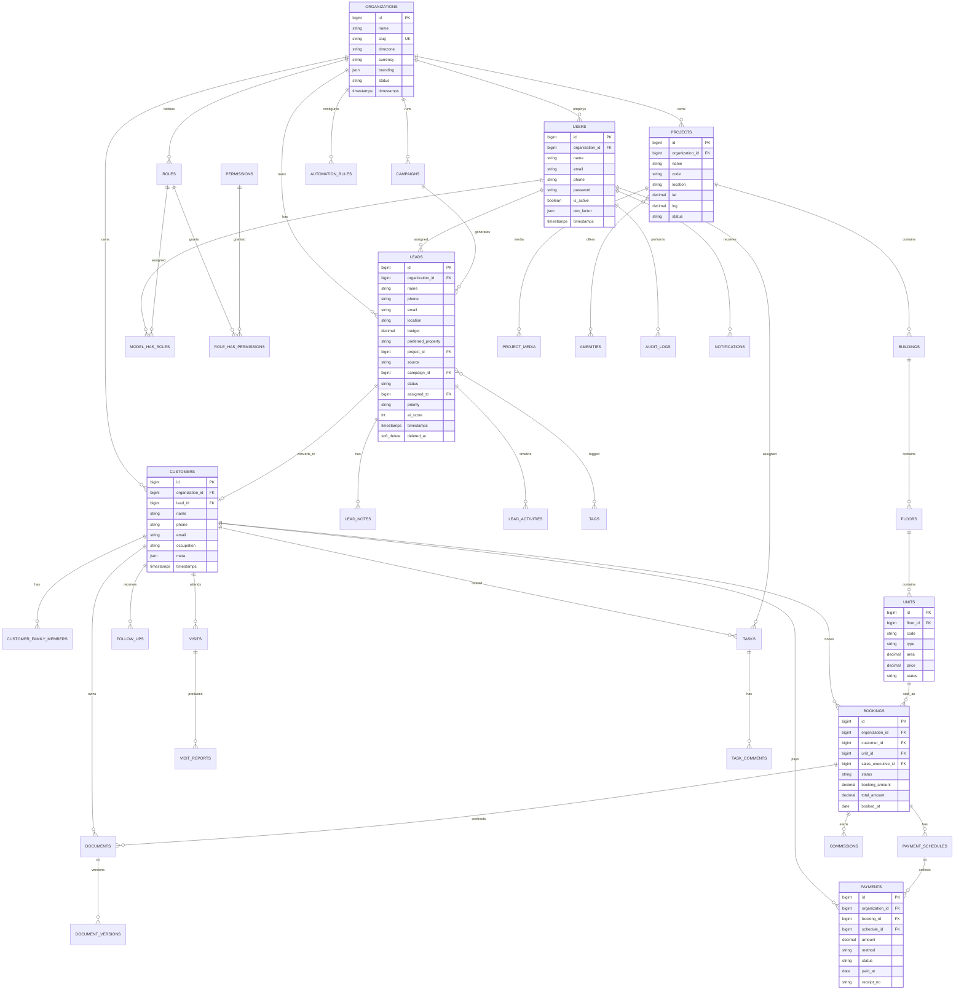

# Database ER Diagram — Homora CRM

## Entity Relationship (Mermaid)

## Core Tables (MVP)

| Table | Purpose |
|-------|---------|
| `organizations` | Tenants |
| `users` | People (scoped + super admins) |
| `roles`, `permissions`, pivots | RBAC |
| `leads`, `lead_notes`, `lead_activities`, `tags`, `taggables` | Lead CRM |
| `customers`, `customer_family_members` | Customer 360 |
| `projects`, `buildings`, `floors`, `units`, `amenities`, `amenity_project`, `media` | Inventory |
| `campaigns` | Marketing |
| `visits`, `visit_reports` | Site visits |
| `follow_ups` | Reminders |
| `tasks`, `task_comments` | Task mgmt |
| `documents`, `document_versions` | DMS |
| `bookings`, `payment_schedules`, `payments`, `refunds`, `commissions` | Sales & money |
| `automation_rules`, `automation_runs` | Automation |
| `notifications` | In-app |
| `audit_logs` | Security trail |
| `personal_access_tokens` | Sanctum |
| `jobs`, `failed_jobs`, `job_batches` | Queues |

## Indexing Strategy

- `(organization_id, status)` on leads, bookings, payments
- `(organization_id, phone)`, `(organization_id, email)` on leads/customers
- `(assigned_to, status, due_at)` on follow_ups/tasks
- `(organization_id, created_at)` for dashboard ranges
