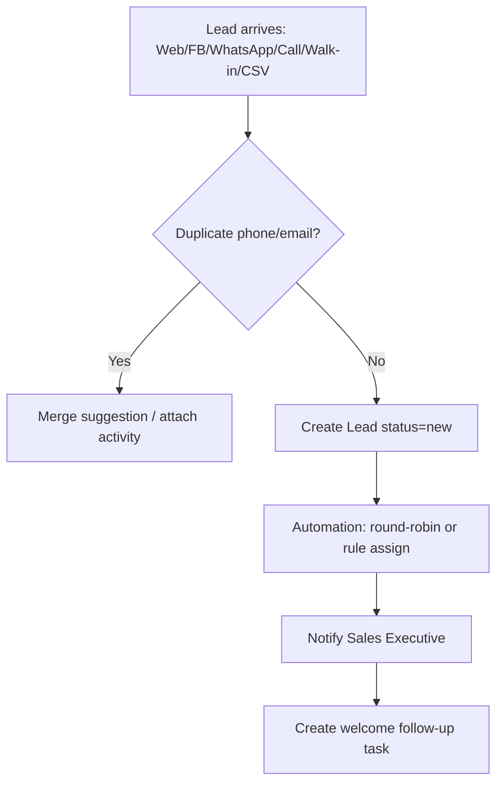
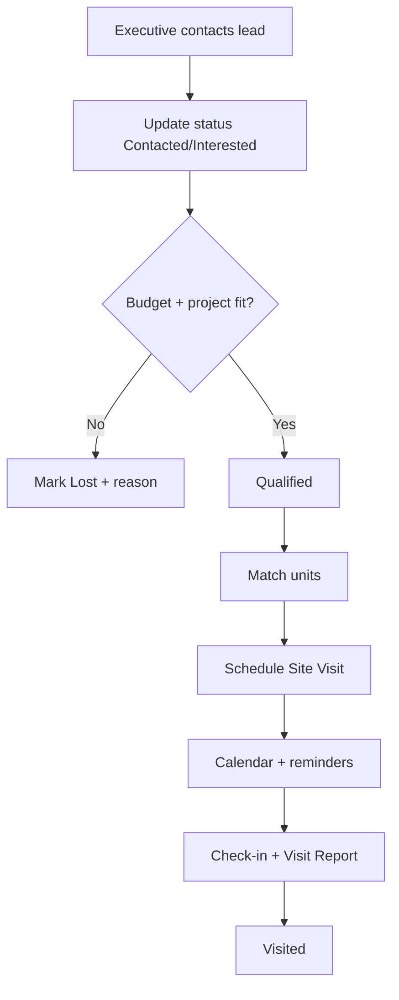
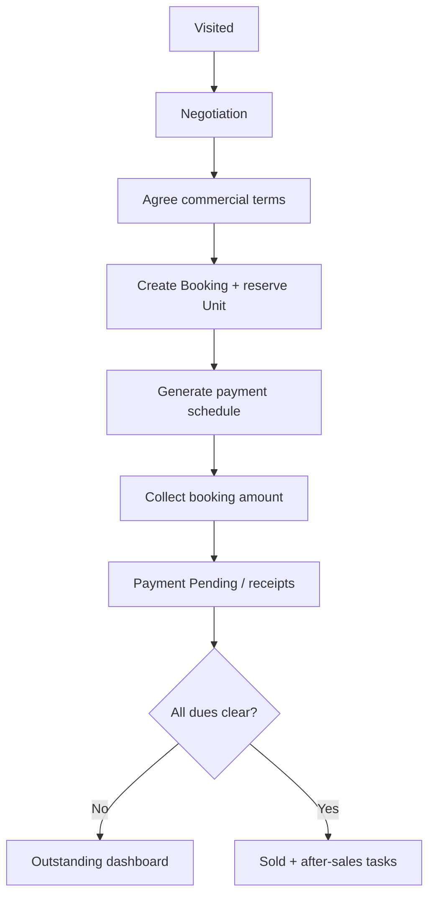
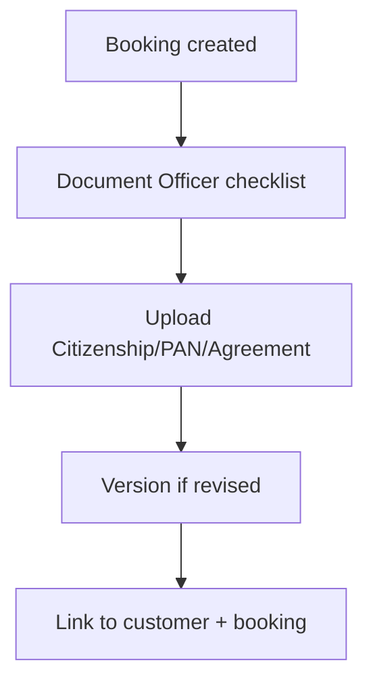
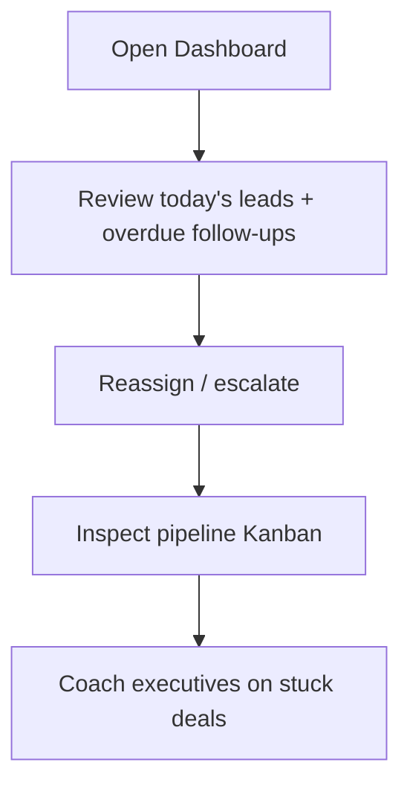

# User Flows — Homora CRM

## 1. Lead Capture → Assignment

## 2. Qualification → Site Visit

## 3. Negotiation → Booking → Payment

## 4. Document Pack

## 5. Manager Daily Loop

## 6. Role Entry Points

| Role | Home Screen |
|------|-------------|
| Company Owner | Executive dashboard |
| Sales Manager | Pipeline + team performance |
| Sales Executive | My leads + today's follow-ups |
| Marketing | Campaigns + ROI |
| Reception | Quick lead / visit create |
| Accountant | Outstanding payments |
| Document Officer | Pending document checklist |
| Viewer | Read-only reports |
